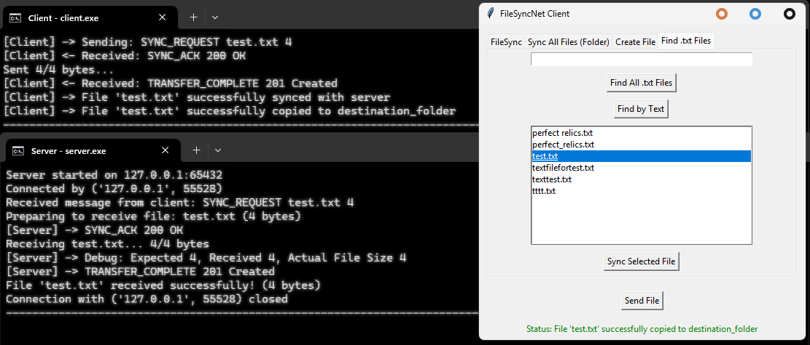

<p align="center">
  <a href="https://www.rust-lang.org/" target="blank"></a>
</p>

[ci-image]: https://img.shields.io/github/actions/workflow/status/rust-lang/rust/ci.yml?branch=master
[ci-url]: https://github.com/rust-lang/rust/actions

<p align="center">A robust and modern <a href="https://www.rust-lang.org/" target="_blank">Rust</a> framework for building high-performance and reliable server-side applications.</p>
<p align="center">
<a href="https://crates.io/crates" target="_blank"></a>
<a href="https://doc.rust-lang.org/" target="_blank"></a>
<a href="https://github.com/rust-lang/rust" target="_blank"></a>
<!-- <a href="https://codecov.io/gh/rust-lang/rust" target="_blank"></a> -->
<a href="https://discord.gg/rust-lang" target="_blank"></a>
<a href="https://github.com/sponsors/rust-lang" target="_blank"></a>
<a href="https://twitter.com/rustlang" target="_blank"></a>
</p>

# FileSyncProject

Test FileSync

## Requirements
- [Rust](https://www.rust-lang.org/tools/install)
- [NodeJS](https://nodejs.org/en) **(Optional)**

## Download & Run

[FileSyncProject.zip](https://github.com/TonRattakan/FileSyncProject/archive/refs/heads/main.zip)

1. Extract `FileSyncProject.zip`.
2. Navigate to the `FileSyncProject folder` and double-click **run.bat**.

## Manual Download & Run
```bash
git clone https://github.com/TonRattakan/FileSyncProject.git
cd FileSyncProject
cargo run --bin filesync_server
cargo run --bin filesync_client
```
## Output
The following message should appear:

**"Received: Object {"command": String("UPLOAD_FILE"), "filename": String("test.txt"), "filesize": Number(762528)}**

**📄 Receiving file: test.txt (762528 bytes)"**


